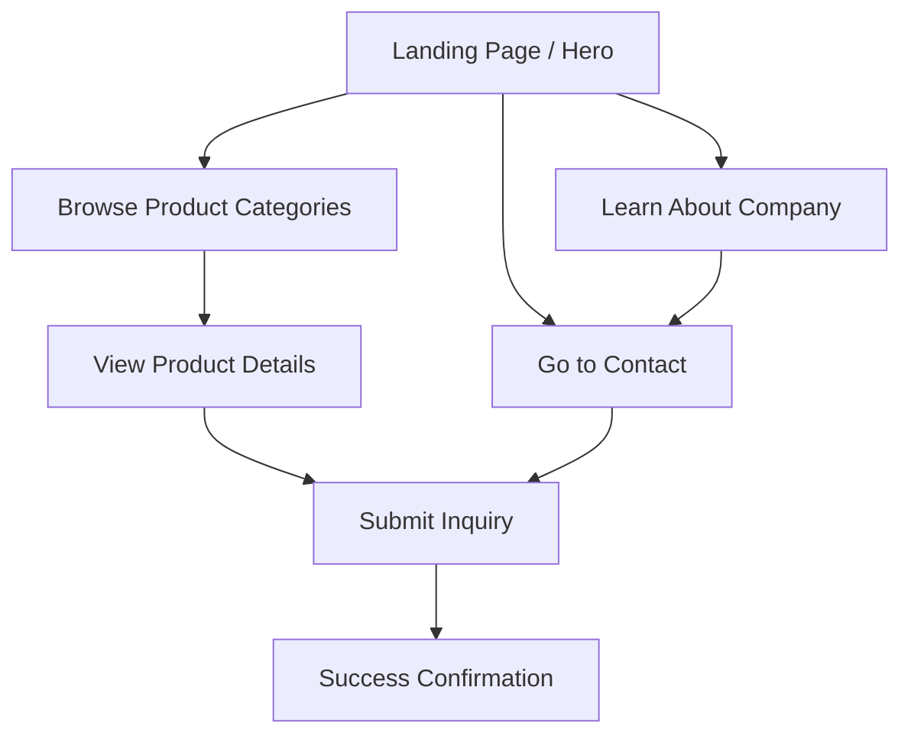
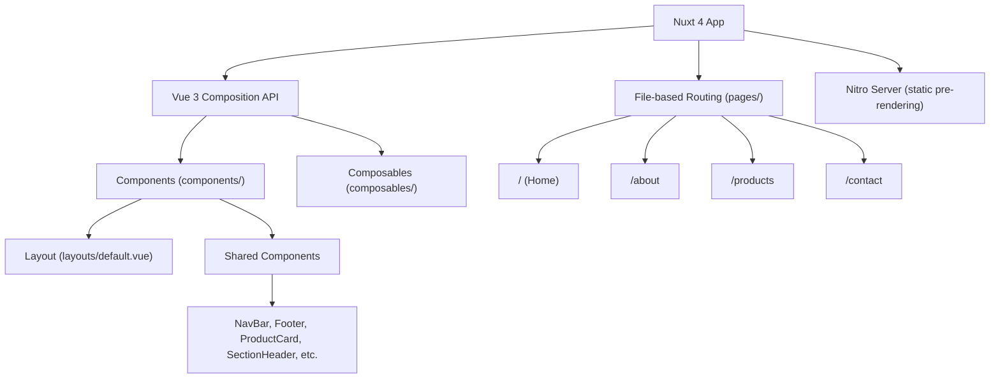

# SealPro Company Profile Website — Implementation Plan

## 1. Product Overview

A modern company profile website for **SealPro** (placeholder), a B2B distributor of industrial silicone sealants. The site establishes credibility, showcases products, and generates business inquiries. Target audience: construction companies, manufacturers, procurement managers, and industrial contractors.

## 2. Core Features

### 2.1 Pages & Modules

| Page | Route | Core Modules |
|------|-------|-------------|
| Home | `/` | Hero banner, trust indicators (stats/clients), product category overview, CTA to contact |
| About Us | `/about` | Company story, mission & vision, core values, key team/leadership |
| Products | `/products` | Product categories (acetic cure, neutral cure, high-temp, specialty), product cards with specs, filter by category |
| Contact | `/contact` | Contact form (name, email, company, message), company address & phone, embedded map placeholder |

### 2.2 Page Details

| Page | Module | Description |
|------|--------|-------------|
| Home | Hero Section | Full-viewport hero with bold industrial imagery, company tagline, and primary CTA ("Explore Products" / "Get a Quote"). Subtle geometric pattern background. |
| Home | Trust Bar | Animated counter row: years of experience, clients served, products distributed, countries covered. |
| Home | Category Overview | 3-4 product category cards with icon, short description, and "View Category" link. Grid layout. |
| Home | CTA Banner | Full-width call-to-action band with contact button and phone number, before footer. |
| About | Company Story | Timeline or narrative section with company history and milestones. |
| About | Mission & Vision | Two-column layout with mission and vision statements, icon-accented. |
| About | Core Values | Card grid: Quality, Reliability, Innovation, Partnership — each with icon and description. |
| Products | Category Filter | Horizontal filter tabs/pills for product categories (Acetic Cure, Neutral Cure, High-Temp, Specialty). |
| Products | Product Grid | Responsive grid of product cards. Each card: product name, short description, key specs (temperature range, cure type, color), and "Inquire" button. |
| Contact | Contact Form | Name, Email, Company, Message fields with validation. Submit shows success state (no backend — console.log or placeholder). |
| Contact | Company Info | Address, phone, email, business hours displayed with icons. |
| Contact | Map Placeholder | Styled map placeholder area (static image or CSS-drawn map representation). |

### 2.3 Core User Flow



## 3. User Interface Design

### 3.1 Design Direction: Industrial Modern

**Concept**: Raw industrial materials meet refined modern typography. Think steel, concrete textures, and precision engineering — conveyed through color, geometry, and motion rather than literal textures.

**Color Palette**:
- **Primary Base**: Zinc-900 (#18181B) — deep near-black for headers, footer, primary surfaces
- **Secondary Base**: Zinc-100 (#F4F4F5) — light background for content sections
- **Accent Primary**: Amber-500 (#F59E0B) — CTAs, highlights, active states (evokes industrial warmth, chemical precision)
- **Accent Secondary**: Cyan-600 (#0891B2) — secondary highlights, links, category badges (technical/chemical feel)
- **Surface**: White (#FFFFFF) and Zinc-50 (#FAFAFA) cards on light sections

**Typography**:
- **Display/Headings**: "DM Serif Display" (serif) — distinctive, authoritative, memorable. Used for hero titles and section headers.
- **Body**: "DM Sans" (sans-serif) — clean, highly readable, pairs perfectly with DM Serif Display. Used for all body text, navigation, and UI elements.

**Spatial Composition**:
- Generous negative space with asymmetric section dividers (diagonal cuts, angled separators)
- Grid-breaking hero elements — title bleeds off-center
- Alternating light/dark section bands for visual rhythm
- Industrial geometric accents: thin horizontal rules, angled corner brackets on cards

**Motion & Micro-interactions**:
- Staggered fade-up reveals on scroll for all sections
- Counter animation for trust-bar statistics
- Hover: cards lift with shadow, CTAs scale slightly
- Page transitions: smooth crossfade between routes
- Product filter: animated pill selection with smooth grid reflow

**Visual Details**:
- Subtle dot-grid or line-grid pattern overlay on dark hero background
- Thin amber accent lines as section dividers
- Card borders: 1px zinc-200 with hover → amber-500 transition
- Contact form: clean outlined inputs with amber focus ring

### 3.2 Responsiveness

Desktop-first design. Breakpoints:
- **Desktop**: 1280px+ (primary target — B2B audience on desktops)
- **Tablet**: 768px-1279px (stacked grids, adjusted typography scale)
- **Mobile**: <768px (single column, hamburger nav, stacked sections)

## 4. Technical Architecture

### 4.1 Architecture Diagram



### 4.2 Technology Stack

| Layer | Technology | Purpose |
|-------|-----------|---------|
| Framework | Nuxt 4 (latest) | Vue meta-framework, SSR/SSG, file-based routing |
| UI | Vue 3 + Composition API (`<script setup lang="ts">`) | Component logic |
| Styling | Tailwind CSS v4 | Utility-first CSS with design tokens |
| Icons | lucide-vue-next | Consistent icon library |
| Fonts | DM Serif Display + DM Sans (Google Fonts) | Typography |
| Package Manager | pnpm | Fast, disk-efficient |
| Language | TypeScript | Type safety |
| Build | Nuxt Nitro (static generation) | Pre-render all pages as static HTML |

### 4.3 Route Definitions

| Route | File | Purpose |
|-------|------|---------|
| `/` | `pages/index.vue` | Home page with hero, trust bar, categories, CTA |
| `/about` | `pages/about.vue` | Company story, mission, vision, values |
| `/products` | `pages/products.vue` | Product catalog with category filter |
| `/contact` | `pages/contact.vue` | Contact form and company information |

### 4.4 Project Structure

```
sealant_compro/
├── .trae/documents/          # Plan & docs (already created)
├── app.vue                    # Nuxt root component
├── nuxt.config.ts             # Nuxt configuration
├── tailwind.config.js         # Tailwind + design tokens
├── tsconfig.json              # TypeScript config
├── package.json
├── assets/
│   └── css/
│       └── main.css           # Tailwind directives + custom fonts
├── components/
│   ├── NavBar.vue             # Sticky top navigation
│   ├── Footer.vue             # Site footer with links & info
│   ├── HeroSection.vue        # Full-viewport hero banner
│   ├── TrustBar.vue           # Animated statistics counter
│   ├── CategoryOverview.vue   # Product category cards grid
│   ├── CTABanner.vue          # Call-to-action banner
│   ├── SectionHeader.vue      # Reusable section title component
│   ├── ProductCard.vue        # Individual product card
│   ├── ContactForm.vue        # Contact form with validation
│   ├── CompanyInfo.vue        # Address, phone, hours display
│   └── MapPlaceholder.vue     # Styled map placeholder
├── composables/
│   └── useScrollReveal.ts     # Scroll-triggered reveal animations
├── data/
│   ├── products.ts            # Product catalog mock data
│   └── company.ts             # Company info mock data
├── layouts/
│   └── default.vue            # Default layout (NavBar + slot + Footer)
├── pages/
│   ├── index.vue              # Home page
│   ├── about.vue              # About page
│   ├── products.vue           # Products page
│   └── contact.vue            # Contact page
└── public/
    └── favicon.ico
```

### 4.5 Component Tree

```
app.vue
└── NuxtLayout (default.vue)
    ├── NavBar.vue
    ├── <NuxtPage />
    │   ├── [index.vue]
    │   │   ├── HeroSection.vue
    │   │   ├── TrustBar.vue
    │   │   ├── SectionHeader.vue
    │   │   ├── CategoryOverview.vue
    │   │   └── CTABanner.vue
    │   ├── [about.vue]
    │   │   ├── SectionHeader.vue (×4)
    │   │   └── (inline sections)
    │   ├── [products.vue]
    │   │   ├── SectionHeader.vue
    │   │   └── ProductCard.vue (×N)
    │   └── [contact.vue]
    │       ├── SectionHeader.vue
    │       ├── ContactForm.vue
    │       ├── CompanyInfo.vue
    │       └── MapPlaceholder.vue
    └── Footer.vue
```

### 4.6 Data Model (Mock Data)

```typescript
// data/products.ts
interface Product {
  id: string
  name: string
  category: 'acetic-cure' | 'neutral-cure' | 'high-temp' | 'specialty'
  description: string
  specs: {
    temperatureRange: string
    cureType: string
    color: string
    application: string
  }
}

// data/company.ts
interface CompanyInfo {
  name: string
  tagline: string
  description: string
  founded: number
  stats: { label: string; value: number; suffix: string }[]
  values: { title: string; description: string; icon: string }[]
  contact: { address: string; phone: string; email: string; hours: string }
}
```

## 5. Implementation Steps

### Step 1: Initialize Nuxt 4 Project
- Create Nuxt 4 project manually (not via vite-init templates, as Nuxt is not in available templates)
- Configure `nuxt.config.ts` with Tailwind CSS v4, Google Fonts, and SSG mode
- Set up TypeScript, pnpm, and project structure

### Step 2: Design System & Base Styles
- Configure Tailwind with custom color tokens (zinc, amber, cyan palette)
- Add DM Serif Display + DM Sans via Google Fonts
- Create CSS custom properties for the design system
- Set up base typography scale and global styles

### Step 3: Layout Shell
- Create `layouts/default.vue` with NavBar + Footer
- Build `NavBar.vue`: sticky, transparent-to-solid on scroll, logo placeholder, nav links, mobile hamburger
- Build `Footer.vue`: dark background, company info, quick links, copyright

### Step 4: Home Page
- `HeroSection.vue`: full-viewport hero with geometric pattern, tagline, dual CTA
- `TrustBar.vue`: animated counter row using Intersection Observer
- `CategoryOverview.vue`: product category cards with icons
- `CTABanner.vue`: full-width call-to-action strip
- Compose in `pages/index.vue`

### Step 5: About Page
- Company story section with timeline/data visualization
- Mission & Vision two-column
- Core Values card grid
- Compose in `pages/about.vue`

### Step 6: Products Page
- Category filter tabs with active state
- Product grid with `ProductCard.vue` components
- Filter logic using Vue computed + reactive state
- Compose in `pages/products.vue`

### Step 7: Contact Page
- `ContactForm.vue` with form validation (vee-validate or manual)
- `CompanyInfo.vue` with icon-labeled info rows
- `MapPlaceholder.vue` with styled placeholder
- Compose in `pages/contact.vue`

### Step 8: Animations & Polish
- Implement `useScrollReveal.ts` composable for staggered fade-up reveals
- Add counter animation to TrustBar
- Add hover transitions to cards and buttons
- Page transition animations

### Step 9: Responsive QA
- Test all pages at desktop, tablet, and mobile breakpoints
- Adjust spacing, typography, and layouts for each breakpoint
- Ensure mobile nav works correctly

### Step 10: Build & Verify
- Run `nuxt generate` for static pre-rendering
- Verify all pages load correctly
- Check accessibility basics (contrast, semantic HTML, ARIA)

## 6. Assumptions & Decisions

| Decision | Rationale |
|----------|-----------|
| Placeholder company name: "SealPro" | Generic, industry-appropriate, easily replaceable |
| Static site (SSG), no backend | Company profile is content-only; no dynamic data needed |
| No CMS/database | All content is mock data in TypeScript files; easy to replace with a CMS later |
| Desktop-first responsive | B2B audience primarily browses on desktop |
| No authentication | Public company profile — no user accounts needed |
| Contact form client-side only | No backend; form submits with console.log + success feedback |
| No image assets — CSS-only visuals | Avoid placeholder images; use CSS gradients, geometric patterns, and iconography instead |
| lucide-vue-next for icons | Vue-compatible, consistent, extensive icon set |
| DM Serif Display + DM Sans | Distinctive, authoritative serif paired with clean sans-serif; not overused like Inter/Roboto |

## 7. Verification

- All 4 pages render correctly at 1280px, 768px, and 375px viewports
- Navigation works between all pages
- Product filter correctly shows/hides products by category
- Contact form validates required fields and shows success state
- Scroll animations trigger on each section
- Trust bar counters animate on scroll into view
- No console errors
- `nuxt generate` completes without errors
- Lighthouse: 90+ Performance, 100 Accessibility, 90+ Best Practices
